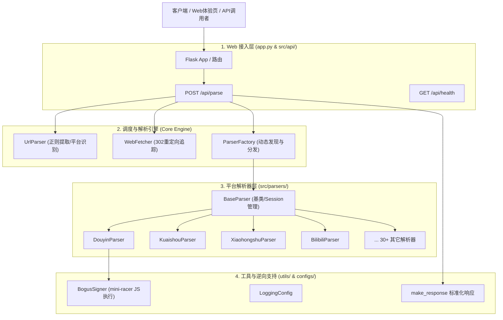
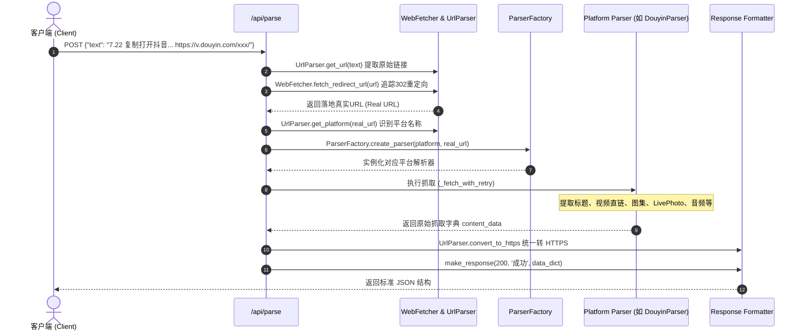

# 系统架构与解析生命周期设计 (Architecture)

本文档详细阐述 **Media Parser** 的内部架构分层、请求处理生命周期、工厂模式插件化发现机制以及数据响应标准。

---

## 🏛️ 整体分层架构

项目遵循模块化、高内聚、低耦合的设计原则，自底向上分为以下四层：



### 📂 源码目录组织与模块映射

```text
media-parser/
├── app.py                     # 应用入口 (Flask Web 服务与 API 启动)
├── configs/                   # 核心配置 (域名平台映射、日志配置等)
├── docs/                      # 逆向百科与开发文档体系
│   ├── architecture.md        # 系统分层架构与生命周期设计
│   ├── reverse-guide.md       # 通用逆向方法论 (抓包/SSR/JS签名提取)
│   ├── testing.md             # 完整测试规范与回归手册
│   └── parsers/               # 平台逆向分析手册
├── src/                       # 核心业务逻辑
│   ├── api/                   # RESTful API 路由 (/api/parse, /api/health)
│   ├── web/                   # Demo 体验页与交互蓝图
│   ├── parsers/               # 各平台解析器模块 (核心解析逻辑)
│   └── parser_factory.py      # 工厂分发器 (解析器动态发现与自动注册)
├── utils/                     # 底层工具库与逆向支持
│   ├── signer/                # JS 签名沙箱引擎 (a_bogus 等算法执行)
│   └── web_fetcher.py         # 智能 URL 识别、重定向追踪与请求封装
├── tests/                     # 完备的双层测试体系
│   ├── live_parser_samples.json # 平台真实多形态在线样本库
│   ├── manual_verify_parsers.py # 命令行交互式冒烟与健康检查工具
│   └── test_*_parser.py         # 各平台 Mock 自动化单元测试
├── static/ & templates/       # Web 演示页面前端静态资源
└── docker-compose.yml         # 容器化一键部署编排
```

---

## 🔄 请求处理生命周期 (Lifecycle)

当客户端向 `/api/parse` 发送一段包含分享文案的文本时，完整处理流如下：



---

## 🧩 插件化解析器设计 (ParserFactory)

为了便于扩展和多人协作，解析器采用 **装饰器自动注册 + 模块自动发现机制**：

### 1. 自动发现 (`_discover`)
[src/parser_factory.py](file:///Users/leo/Projects/media-parser/src/parser_factory.py) 会在模块载入时利用 `pkgutil.iter_modules` 自动扫描并动态 `import` `src/parsers/` 下所有除 `base_parser` 以外的 Python 模块。

### 2. 声明式注册 (`@register_parser`)
新增任何平台解析器时，**无需修改任何工厂类核心代码**，只需继承 `BaseParser` 并加上装饰器：

```python
from src.parser_factory import register_parser
from src.parsers.base_parser import BaseParser

@register_parser("示例平台", "示例平台别名")
class ExampleParser(BaseParser):
    def __init__(self, real_url):
        super().__init__(real_url)
        # 初始化与数据提取
        
    def get_real_video_url(self):
        return "https://..."
```

---

## 📦 统一响应格式标准 (Data Contract)

所有解析接口均通过 `utils/common_utils.py` 中的 `make_response` 返回一致的 JSON 响应体。

### 成功响应示例 (`200 OK`)
```json
{
  "code": 200,
  "msg": "成功",
  "data": {
    "platform": "抖音",
    "video_id": "7616399587141737704",
    "title": "视频文案标题",
    "video_url": "https://aweme.snssdk.com/aweme/v1/play/...",
    "cover_url": "https://p3-pc.douyinpic.com/...",
    "author": {
      "nickname": "创作者昵称",
      "author_id": "unique_id_123",
      "avatar": "https://p3.douyinpic.com/..."
    },
    "audio_url": "https://sf6-cdn-tos.douyinstatic.com/...",
    "image_list": [
      {
        "url": "https://p3-pc.douyinpic.com/image1.jpeg",
        "live_photo_url": "https://aweme.snssdk.com/aweme/v1/play/live_photo.mp4"
      }
    ],
    "video_list": []
  },
  "success": true
}
```

### 错误响应示例 (`400 / 500`)
```json
{
  "code": 400,
  "msg": "未找到有效的分享链接",
  "data": null,
  "success": false,
  "error_code": "URL_NOT_FOUND"
}
```
