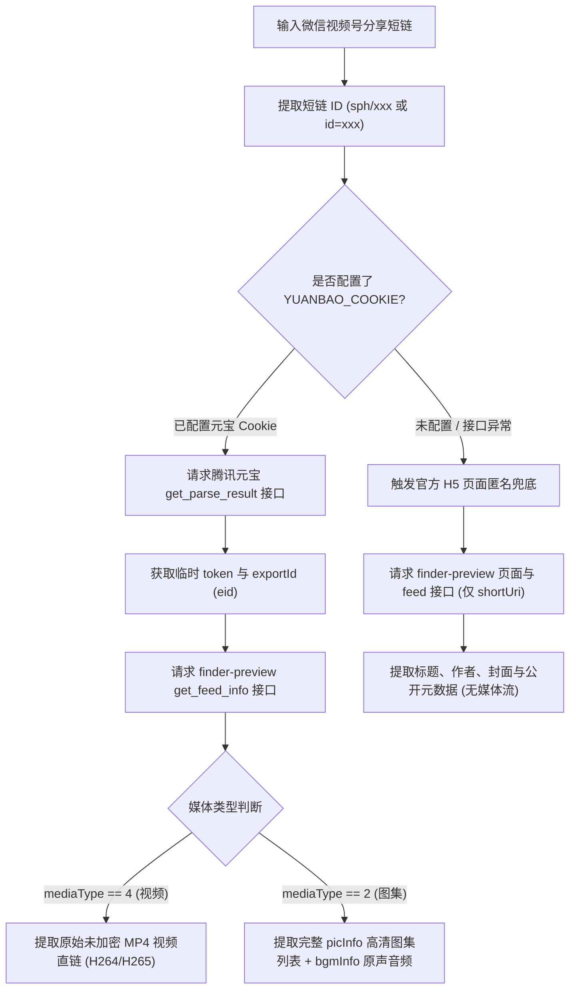

# 微信视频号 (WeChat Channels) 逆向解析指南

本篇详细记录 **微信视频号** 分享短链的解析方案，涵盖视频流、图文图集及背景音乐的逆向提取机制。

---

## 1. 平台特征与支持能力

* **平台标识**：`视频号` / `微信视频号`
* **支持媒体类型**：
  * 无水印短视频 (MP4 / H264 / H265)
  * 高清图集 (图片列表 `image_list`)
  * 背景音乐 / 视频原声 (BGM `audio_url`)
  * 封面图与创作者信息 (昵称、头像)
* **常见链接形态**：
  * 视频号视频短链：`https://weixin.qq.com/sph/AzGrUgqzFv`
  * 视频号图集短链：`https://weixin.qq.com/sph/APclmPJEZ0`
  * H5 预览页长链：`https://channels.weixin.qq.com/finder-preview/pages/sph?id={short_id}`
* **Cookie 依赖**：
  * **公开基础信息 (标题/作者/封面)**：**无需 Cookie**（匿名请求官方 Finder Preview H5 页面即可提取）。
  * **完整媒体流 (高清无水印视频 / 高清图集 / 原声音乐)**：由于微信官方对媒体流和图集进行了鉴权限制（匿名访问仅返回 `picInfo: []` 与封面图），系统采用**腾讯元宝接口代理**方案，需在 `.env` 中配置 `YUANBAO_COOKIE`。
  * ⚠️ **隐私提示**：`YUANBAO_COOKIE` 包含腾讯元宝平台个人账号的会话凭证（`hy_user` 与 `hy_token`），属于**个人账号登录隐私凭证**，**强烈建议使用闲置小号**进行配置。

---

## 2. 核心逆向流程与双轨架构



### 2.1 核心 API
* **腾讯元宝视频号代解析接口 (需鉴权)**：
  `POST https://yuanbao.tencent.com/api/weixin/get_parse_result`
  * 请求体：`{"type": "video_channel_url", "url": real_url, "scene": 1}`
  * 返回临时播放地址 `playable_url`，从中提取 `token` 与 `eid` (`exportId`)。
* **微信视频号官方 Feed 数据接口**：
  `POST https://channels.weixin.qq.com/finder-preview/api/feed/get_feed_info?_rid={rid}&_pageUrl={pageUrl}`
  * 匿名模式：请求体传递 `{"baseReq": {"generalToken": ""}, "shortUri": short_uri}`
  * 元宝授权模式：请求体传递 `{"baseReq": {"generalToken": token}, "exportId": export_id}`

---

## 3. 字段映射与提取逻辑

### 3.1 视频提取
* 视频直链优先从以下字段获取：
  1. `feedInfo.videoUrl`
  2. `feedInfo.h264VideoInfo.videoUrl`
  3. `feedInfo.h265VideoInfo.videoUrl`

### 3.2 图集 (Photo Album) 提取
* 当视频号内容为多图作品时 (`mediaType == 2`)，`videoUrl` 为空：
  * **图片列表**：遍历 `feedInfo.picInfo` 数组，提取每个元素的 `url` 属性。
  * **背景音乐**：提取 `feedInfo.bgmInfo.bgmUrl` 字段作为原声音频直链。

---

## 4. Cookie 配置指南

1. 打开浏览器访问 [腾讯元宝网页版](https://yuanbao.tencent.com/) 并登录账号（建议使用小号）。
2. 按 `F12` 打开开发者工具，在 **Application ➔ Cookies** 中提取核心登录凭证：`hy_user` 与 `hy_token`。
3. 在 `.env` 中配置：
   ```env
   YUANBAO_COOKIE="hy_user=你的hy_user值; hy_token=你的hy_token值"
   ```

---

## 5. 统一数据结构示例

### 5.1 图集作品响应
```json
{
  "code": 200,
  "msg": "成功",
  "data": {
    "platform": "视频号",
    "title": "记录即将进入我的第九个学年",
    "author": {
      "nickname": "UU球177",
      "avatar": "https://wx.qlogo.cn/finderhead/..."
    },
    "cover_url": "https://finder.video.qq.com/...",
    "video_url": null,
    "image_list": [
      "https://finder.video.qq.com/251/20304/stodownload?encfilekey=...",
      "https://finder.video.qq.com/251/20304/stodownload?encfilekey=..."
    ],
    "audio_url": "https://wx.music.tc.qq.com/C400001L8NHL4bhNYN.m4a?..."
  }
}
```

---

## 6. 测试与验证

* **单元测试**：[tests/test_wechat_channels_parser.py](file:///Users/leo/Projects/media-parser/tests/test_wechat_channels_parser.py)
* **执行命令**：`python3 -m unittest tests/test_wechat_channels_parser.py`
